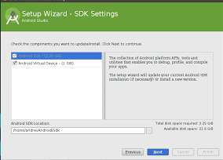
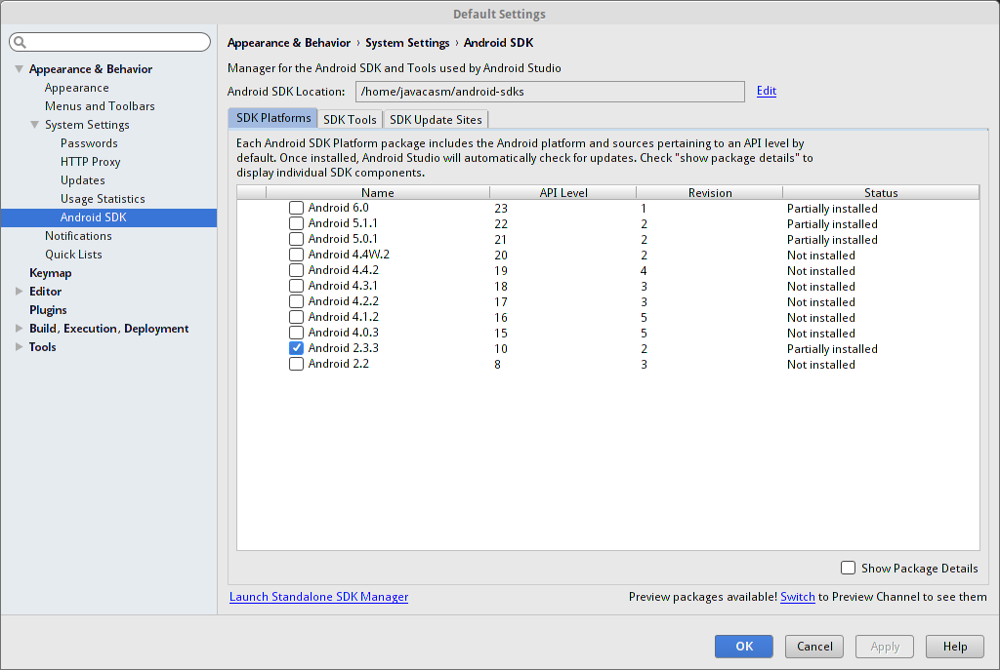
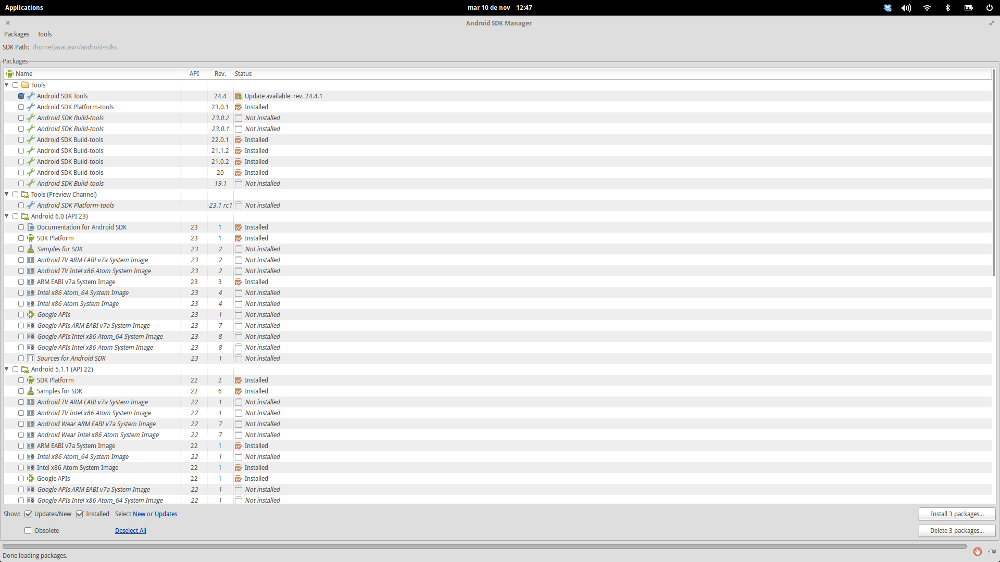
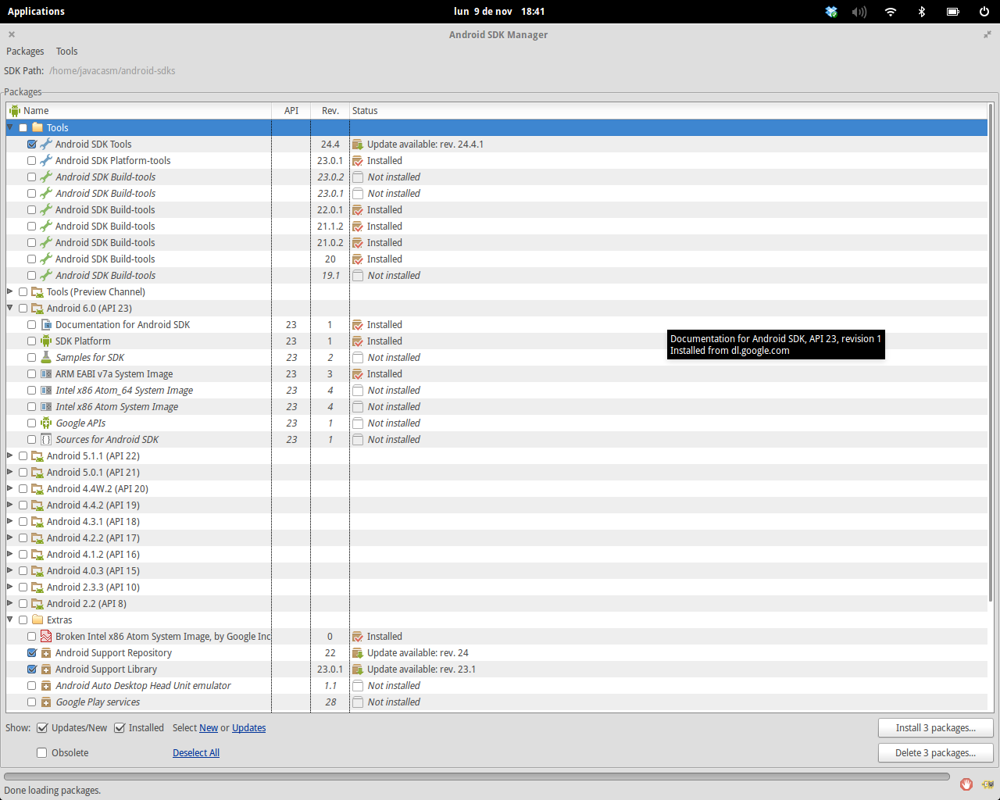

# Desarrollo de aplicaciones Android (161811FP07)

## Marzo-Abril de 2016. CEP de Granada

## José Antonio Vacas @javacasm

javacasm@gmail.com

# Procedimiento de instalación de Android Studio

## [Características mínimas del equipo](./requisitos.md)

### [Requisitos de equipo](http://developer.android.com/sdk/index.html#Requirements)

## Windows

* Microsoft® Windows® 8/7/Vista (32 or 64-bit)
* 2 GB RAM mínimo, 4 GB RAM recomendado
* 400 MB de espacio en disco
* Como poco 1 GB por cada Android SDK, emulador system images, y caches
* 1280 x 800 de resolución mínimo
* Java Development Kit (JDK) 7
* Para utilizar aceleración en el  emulador : Intel® processor debe permitir Intel® VT-x, Intel® EM64T (Intel® 64), y funcionalidad Execute Disable (XD) Bit

## Mac OS X

* Mac® OS X® 10.8.5 or higher, up to 10.9 (Mavericks)
* 2 GB RAM mínimo, 4 GB RAM recomendedo
* 400 MB de espacio en disco
* Como poco 1 GB por cada Android SDK, emulador system images, y caches
* 1280 x 800 de resolución mínimo
* Java Runtime Environment (JRE) 6
* Java Development Kit (JDK) 7
* Para utilizar aceleración en el  emulador : Intel® processor debe permitir Intel® VT-x, Intel® EM64T (Intel® 64), y funcionalidad Execute Disable (XD) Bit
* Ejecutar Android Studio con Java Runtime Environment (JRE) 6 para optimización de font rendering.

## Linux

* GNOME or KDE desktop
* GNU C Library (glibc) 2.15 o posterior
* 2 GB RAM mínimo, 4 GB RAM recomendedo
* 400 MB de espacio en disco
* Como poco 1 GB por cada Android SDK, emulador system images, y caches
* 1280 x 800 de resolución mínimo
* Oracle® Java Development Kit (JDK) 7
* Tested en Ubuntu® 14.04, Trusty Tahr (64-bit capaz de ejecutar applicaciones 32-bit)

## Windows

* Microsoft® Windows® 8/7/Vista (32 or 64-bit)
* 2 GB RAM mínimo, 4 GB RAM recomendado
* 400 MB de espacio en disco
* Como poco 1 GB por cada Android SDK, emulador system images, y caches
* 1280 x 800 de resolución mínimo
* Java Development Kit (JDK) 7
* Para utilizar aceleración en el  emulador : Intel® processor debe permitir Intel® VT-x, Intel® EM64T (Intel® 64), y funcionalidad Execute Disable (XD) Bit

## Mac OS X

* Mac® OS X® 10.8.5 or higher, up to 10.9 (Mavericks)
* 2 GB RAM mínimo, 4 GB RAM recomendedo
* 400 MB de espacio en disco
* Como poco 1 GB por cada Android SDK, emulador system images, y caches
* 1280 x 800 de resolución mínimo
* Java Runtime Environment (JRE) 6
* Java Development Kit (JDK) 7
* Para utilizar aceleración en el  emulador : Intel® processor debe permitir Intel® VT-x, Intel® EM64T (Intel® 64), y funcionalidad Execute Disable (XD) Bit
* Ejecutar Android Studio con Java Runtime Environment (JRE) 6 para optimización de font rendering.

## Linux

* GNOME or KDE desktop
* GNU C Library (glibc) 2.15 o posterior
* 2 GB RAM mínimo, 4 GB RAM recomendedo
* 400 MB de espacio en disco
* Como poco 1 GB por cada Android SDK, emulador system images, y caches
* 1280 x 800 de resolución mínimo
* Oracle® Java Development Kit (JDK) 7
* Tested en Ubuntu® 14.04, Trusty Tahr (64-bit capaz de ejecutar applicaciones 32-bit)

## Prerequisitos

Para instalar Android Studio necesitamos intalar primero el entorno de desarrollo de Java (JDK) en su versión 7

No es suficiente con tener instalado el entorno de ejecución de Java (JRE)

### ¿Tengo Java?

Puedes ver la versión que tienes instalada con

	javac -version

Dependiendo de la versión del sistema operativo instalado instalaremos el JDK de 32 o 64 bits.

## Instalación de Android Studio

La instalación de Android Studio es bastante sencilla, basta con ejecutarla y el paquete irá revisando si nos falta algún compomente (de no tener instalado el JDK, en este momento nos lo pediría)

Una vez lanzada la instalación, esta terminará revisando si existen actualizaciones y descargando al menos una versión del SDK de Android.

Hay que tener en cuenta que Android Studio es una herramienta en constante desarrollo, lo que obliga a actualizarla prácticamente todas las semanas. Integra un gestor de actualizaciones que en caso de detectar una versión nos avisa

## SDK de Android

El SDK de Android es el conjunto de librerías, documentación (también ejemplos), código e imágenes de emuladores necesario para poder desarrollar aplicaciones específicas para una versión dada.

Existe un SDK por cada una de las versiones de Android. No es necesario tener todos los SDKs instalado, pero para probar a fondo las aplicaciones sí es conveniente tener al menos los más usados.

Cada SDK ocupa algo más de 1Gb de espacio en disco, con lo que la descarga y la posterior instalación puede ser larga.

A menudo los SDKs se actualizan (por errores de propio software o porque aparecer actualizados para los terminales) con lo que se hace necesaria una herramienta para gestionar estos cambios y esta es el Gestor de SDKs

## Gestor de actualizaciones (SDK Manager)

Podemos acceder al SDK Manager desde el siguiente icono:

Esta herramienta podemos utilizarla en un modo simplificado

o en el modo avanzado donde vemos todos los detalles de cada versión

El SDK Manager se encarga de gestionar todos los paquetes que complementan a Android Studio. Por un lado están las herramientas (Tools), que no depende de la versión de Android usada y por otro están los SDks que son específicos para cada versión.

De todos estos componentes, unos pocos necesarios y la mayoría opcionales.

Veamos los que deberíamos instalar:

* Android SDK Tools: son las herramientas generales del entorno.
* Android SDK Platform Tools: la herramientas específicas para cada sistema operativo (por ejemplo el depurador)
* Al menos una de las building Tools (mejor la última). Son las encargadas de construir la aplicación.
* Al menos necesitamos una de las [versiones](./Android FAQ.md#versiones) con los siguientes componentes obligatorios:
	* SDK Platform
	* Una imagen de emulador
Otros componentes recomendados:
	* Ejemplos (samples)
	* Documentación

En esta captura podemos ver como la herramienta nos propone actualizar 3 elementos.
