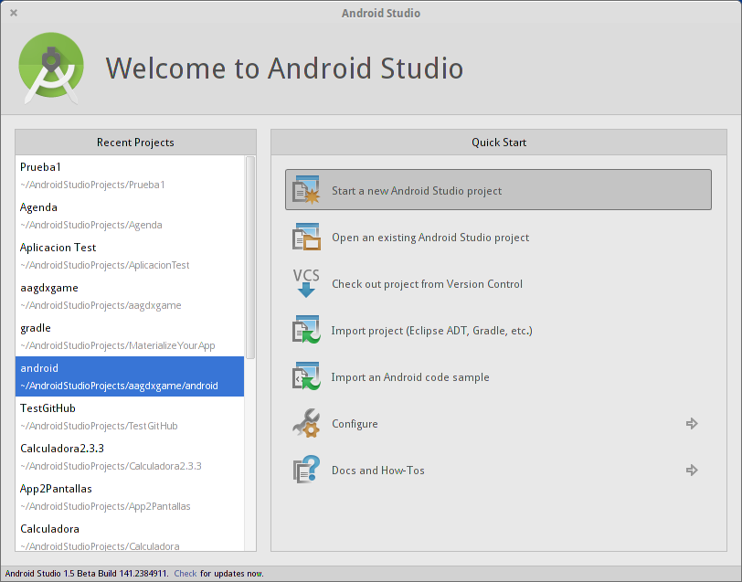
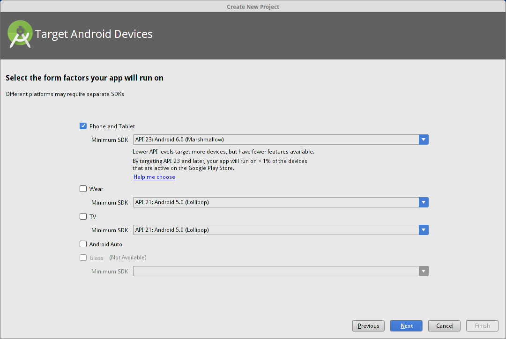
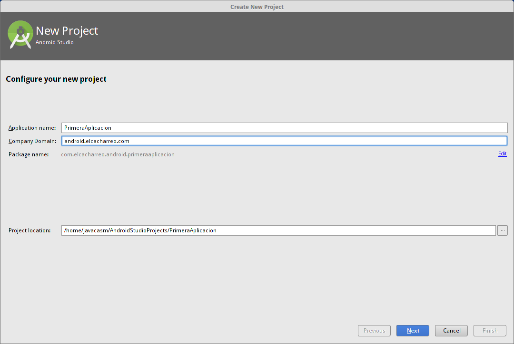
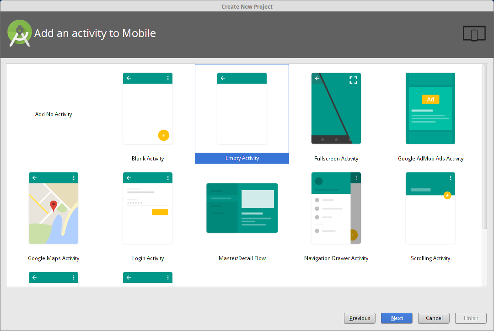
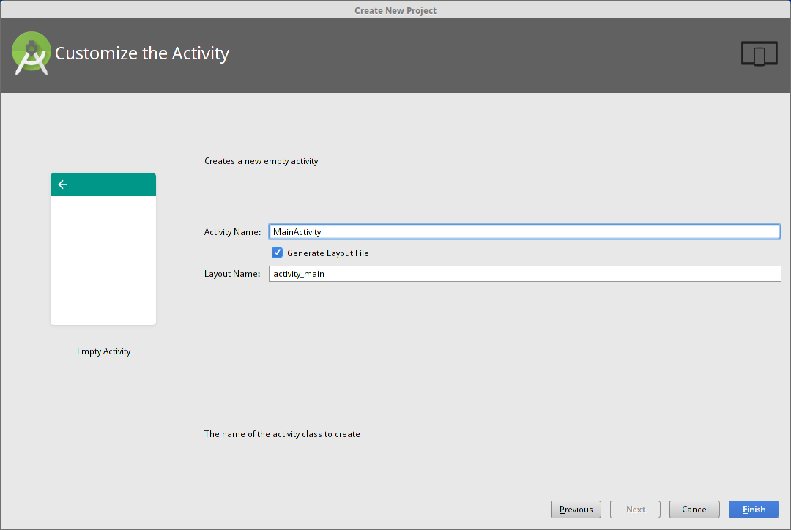
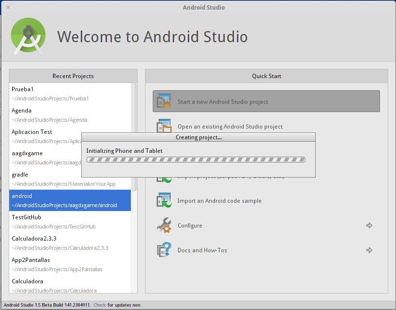
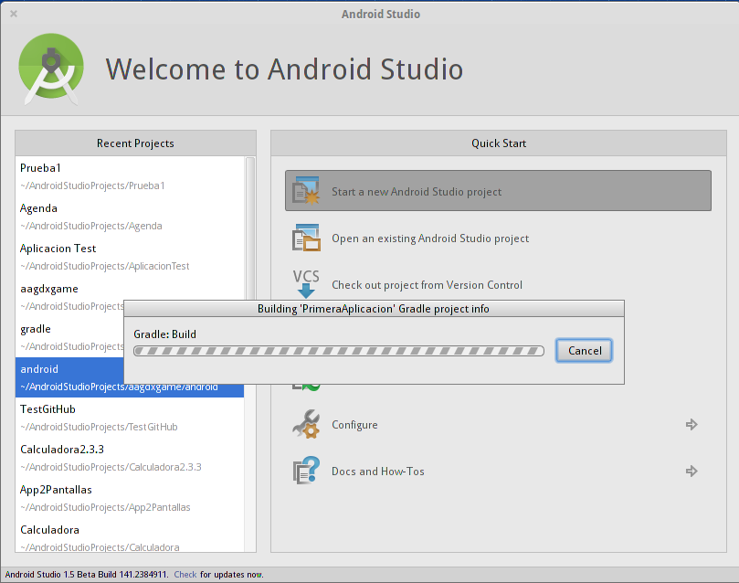
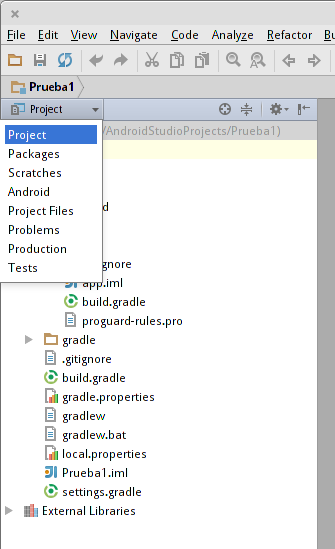
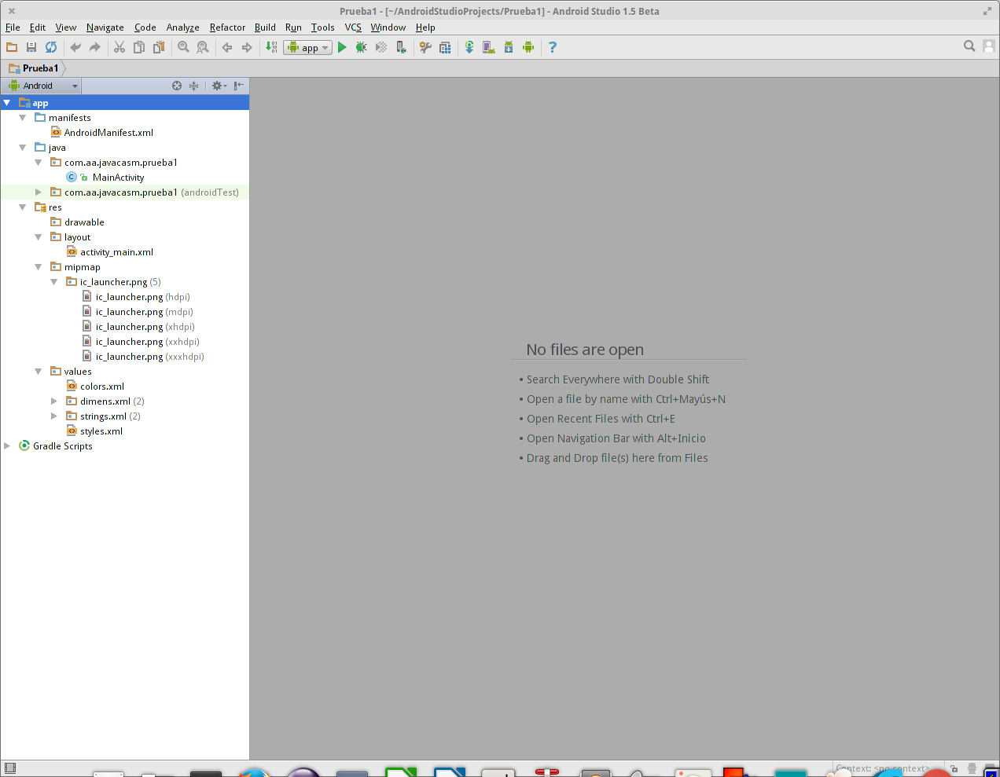
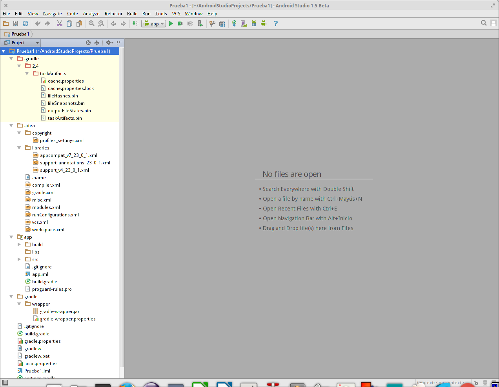

# Desarrollo de aplicaciones Android (161811FP07)

## Marzo-Abril de 2016. CEP de Granada

## José Antonio Vacas @javacasm

javacasm@gmail.com

# Creando la primera aplicación

Siguiendo el asistente vamos a ir viendo algunos de los pricipales componentes de Android

([Ejemplo Hello World](https://github.com/javacasm/HelloWorldAndroid))

1. Pulsamos la opción de crear una nueva aplicación

2. Seleccionamos la arquitectura a la que irá destinada nuestra aplicación, que pueden ser móviles, tablets, TVs, relojes, ...

Cada plataforma tendrá una aplicación distinta, aunque comparten código y recursos

En este momento vamos a seleccionar sólo a opción de hacer crear una aplicación para móviles y tablets.

3. Vamos a dar nombre a la aplicación para lo que tendremos que dar un título que será el que vea el usuario que luego la instale, ** Application Name ** y un ** Package Name ** que es el identificador único de la aplicación que la identifica entre los millones de aplicaciones que existen.

Es importante elegir bien este identificar puesto que es el que se ha de mantener a lo largo de toda la vida de la aplicación. El  ** Application Name ** puede modificarse pero el ** Package Name ** no.

Normalmente el ** Package Name ** se crea a partir de la url de nuestra web, aunque podemos poner cualquier que se no ocurra.

Podemos pensar que el ** Package Name ** es una especie de path que permite identificar de manera única a una aplicación dada entre todas las existentes.

4. Ahora vamos a elegir el tipo de pantalla que va a tener nuestra aplicacion entre las plantillas que nos enseñan

En Android las pantallas se llaman ** Activity **. Podemos pensar en ellas como una pantalla (en el pasado donde las pantallas de los móviles eran pequeñas, pantalla equivalía a funcionalidad, la actividad que podía hacer el usuario).

Vemos que existen distintos plantillas:

* Algunas tienen ya un diseño y están pensadas para hacer algún tipo de tarea concreta, como la de login, o la de acceso a la configuración de la apicación, por ejemplo.

* Otras ya implementan un tipo de navegación: por medio de un menú lateral o al deslizar el elemento a la derecha o a la izquierda como en la aplicacion Galería de fotos

Para empezar vamos a elegir la más simple que la de nombre Empty (la plantilla Blank, que aparece por defecto es sencilla pero tiene algo más de complejidad). Usaremos este tipo sencillo para que la restante funcionalidad no nos produzca más complejidad en nuestro primer proyecto.

Este asistente para crear Activities lo podremos llamar en cualquier momento para poder añadir más pantallas a nuestra aplicación.

Algo que puede llamar nuestra atención es que podemos elegir no crear ningun Activity: efectivamente una aplicación puede funcionar sin tener ninguna pantalla. Se trata de aplicaciones que funcionan en segundo plano, sin la interacción directa del usuario.

Un ejemplo de este tipo de aplicaciones pueden ser las que nos permiten sincronizar nuestros datos con servicios web o las que nos avisan de que hay cambios como por ejemplo pueden ser las aplicaciones de las redes sociales que nos avisan de la actividad de otros miembros de la red.

5. Una vez elegido el tipo hemos de darle nombre:

Por defecto se crearán 2 ficheros:

* Un fichero Java, donde escribiremos nuestro código
* Un fichero de recursos de tipo Layout con formato xml. Un layout es la definición del interface de usuario de una pantala

Estos dos ficheros están conectados en el proyecto. En concreto el fichero java es el que realiza esa conexión. En concreto en la línea

	setContentView(R.layout.activity_main)

6. Con todo esto ya tenemos la aplicación definida, y se generarán todos sus contenidos:

* El código
* Los ficheros XML
* Los ficheros de configuración
* Los recursos

Cuando tengamos todo el proyecto se construirá todo el proyecto, compilando el código, empaquetanto los recursos y generando e fichero APK de la aplicación.

El encargado de hacer todo esto es Gradle, que se dedicará a mantener actualizado nuestro proyecto como un proceso de segundo plano.

# Estructura de una aplicación

Los proyectos de Android Studio son muy complejos en cuanto a que incorporan un gran número de ficheros. La filosofía de Google a la hora de usar el entorno es intentar que los desarrolladores hagamos un trabajo todo lo profesiona posible.

Por eso han dotado al entorno de todo lo necesario para mejorar la calidad de sistema:

* Se han incorporado herramientas de control de versiones como Git o SVN y conectores con repositorios como github.com
* Al crear una aplicación se crean casos de test para garantizar la calidad del código
* Se "obliga" a aplicar buenas prácticas por medio de avisos que se muestran al ir creando las aplicaciones. Un ejemplo de esto puede ser la "obligación" hacer toda aplicación fácilmente traducible.

Esto da lugar a una simple aplicación está compuesta por docenas de ficheros.

Para simplicarnos la vida existen diversas vistas de un mismo proyecto

De todas ellas, las más interesantes de momento son:

* Android: Una vista simplificada que nos muestras los ficheros que se usan y modifican el 90% del tiempo

* Project: vemos todo el detalle del proyecto

Mi recomendación es que inicialmente usemos la vista Android.

Veamos lo que contiene cada carpeta de esta vista Android:

* Código Java
* Recursos
	* diseños:layout
	* imágenes
	* traducciones
	* estilos
