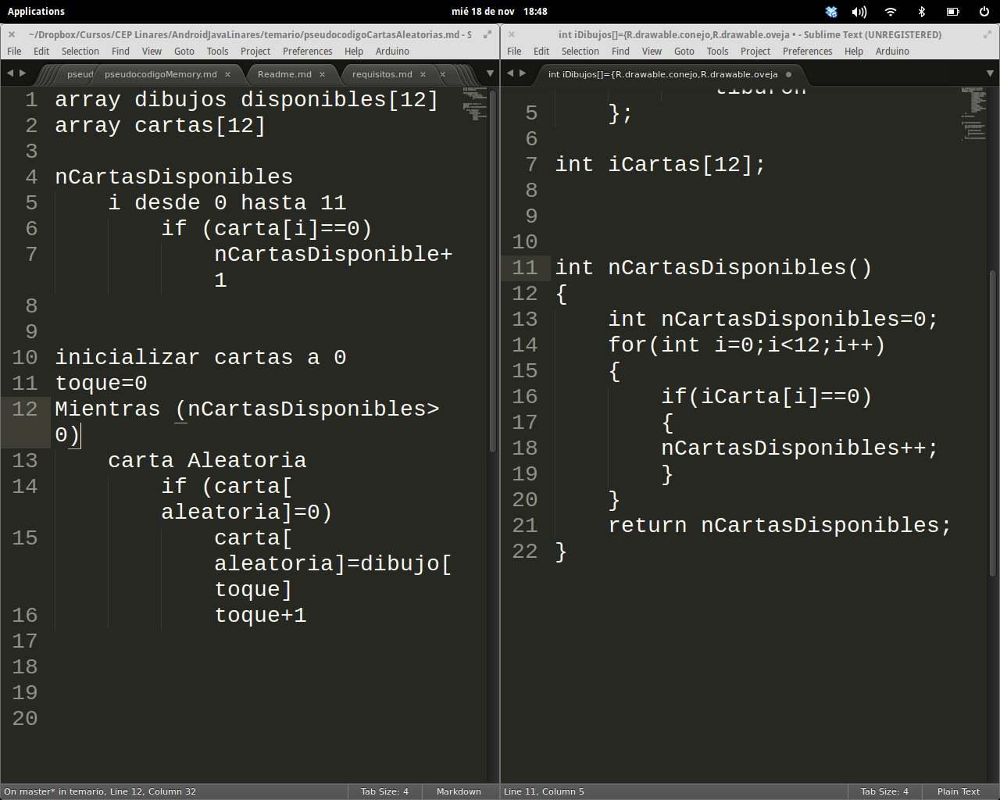

# Desarrollo de aplicaciones Android (161811FP07)

## Marzo-Abril de 2016. CEP de Granada

## José Antonio Vacas @javacasm

javacasm@gmail.com

# Comenzando a programar

## Estructura del código

## Intenta que sea lo más ligera posible

## Clases

* Es programación orientada a objetos
* Tipo
* Herencia
* Estilo de java
	* Nombres		
	* set y get

## Eventos

* Con programación dirigida por eventos
* Listener
* Ciclo de vida de una aplicación

## Acceso a los controles

* (Casting)
* Comentarios
* Ejemplo persona en la calle, entra al CEP, entra a la oficina. Le pido cosas(funciones) distintas

## Activación depuración

* Info tablet
* nº compilación

## Excepciones, globales, casting

# Pseudocódigo de la Calculadora

	introducimos operando1 -> teclanumerica
		esperamos teclas numericas
		añadimos a las cifras anteriores
	introduce operador -> teclaOperador
		guardar operando1 fOperando1=convertir(visor)
		guardar operador  iOperador=R.id.boton
		borramos pantalla  -> teclaC
	introducimos operando2 -> teclanumerica
		esperamos teclas numericas
		añadimos a las cifras anteriores
	pulsamos igual  -> teclaIgual
		guardar operando2
		hacer la operacion
		mostrar resultado
	borramos último numero -> teclaC
		borramos numero en el visor
	reiniciamos -> teclaAC
		inicializar
			borrar operandos y operador -> Inicializacion
			borrar visor ->teclaC

# Programación 2

Vamos a ver algunas técnicas más avanzadas de programación, como pueden ser crear arrays de id o de atributos.

Para ello vamos a hacer una programación TopDown, es decir, empezaremos creando la estructura del código a partir del [pseudocódigo](./presudocodigoMemory.md).

Para ello creamos las funciones:

* inicializacion
* clickImagen
* botonStart
* botonStop

Añadiremos a las funciones pseudocódigo para indicar las tareas que se deben realizar en cada uno de ellos, utilizando comentarios de tipo TODO a los que podremos seguir la pista en la ventana TODO del entorno

    void inicializacion()
    {
        // TODO: rellenar aleatoriamente (rellenar imagenBoton )
        // TODO: cargar sonidos
        // TODO: puntuacion a 0
        // TODO: tiempo a 0
    }

    public void botonStart(View v)
    {
        inicializacion();  // Ya sabemos cómo hacerlo

        // TODO: hacer visible Las cartas (tablelayout.setVisibility(Visible) );

    }
    public void clickImagen(View v)
    {
        // TODO: ¿Y si el boton ya esta pulsado?
        // TODO: Buscar boton para ver su imagen
        // TODO: Mostrar imagen (iv.setImageResource(R.drawable.IMAGEN); )

        // TODO: ¿EsLaPrimera?
        // TODO:	SI Volteamos
        // TODO:    NO
            // TODO: Si imágenes iguales
                // TODO: actualizar visor puntuacion
                // TODO: sonido victoria
                // TODO: No cliceable la 2ª
            // TODO: No son iguales
                // TODO: sonido fracaso total
                // TODO: Volteamos

        }

## Estructura de datos

Ahora vamos a ir declarando las variables necesarias para realizar las tareas que hemos indicado en las funciones

TODO: ¿usar Tag?

    int []imagenBoton={R.drawable.conejo,R.drawable.oveja,R.drawable.pollo,
            R.drawable.conejo,R.drawable.oveja,R.drawable.pollo,
            R.drawable.rinoceronte,R.drawable.serpiente,R.drawable.tiburon,
            R.drawable.rinoceronte,R.drawable.serpiente,R.drawable.tiburon
    };  // Guarda la imagen de cada boton
    int []idBoton={R.id.iv11,R.id.iv12,R.id.iv13,
                  R.id.iv21,R.id.iv22,R.id.iv23,
                  R.id.iv31,R.id.iv32,R.id.iv33,
                  R.id.iv41,R.id.iv42,R.id.iv43}; // Guarda el id de los botones

    int iPuntuacion=0;
    int iTiempo=0;

    boolean bEsLaPrimera=true; // Para saber si es la primera o 2ª carta
    int idBotonPrimeroPulsado=0;
    int idBotonSegundoPulsado=0;
    int idImagenPrimerBotonPulsado=0;

## Código

Ahora vamos a completar el código. La mayor parte tiene una traducción directa. Sólo vamos a comenta el método que busca un control en toda la lista disponible

    int iNumeroBotonPulsado=0;
    for(int i=0;i<12;i=i+1)
    {
        if(v.getId()==idBoton[i])
        {
            iNumeroBotonPulsado=i;
            break;
        }
    }

donde vemos que iteramos por medio de un bucle a lo largo de todos los ids hasta encontrar la del control pulsado. En ese caso guardamos la posición en a variable iNumeroBotonPulsado

## Sonido

## Eventos en diferido

Una característica de Android es ...

TODO: Handler

## Tiempo

Podemos usar:
* Una medida de tiempos "a mano"
* Un control del interface de tiempos Chronometer

Para poner a 0 el tiempo, lo que tenemos que hacer es establecer el tiempo base del cronómetro (algo así como poner en hora)

	mChronometer.setBase(SystemClock.elapsedRealtime());

de http://stackoverflow.com/questions/5345697/chronometer-reset y http://developer.android.com/reference/android/widget/Chronometer.html#setBase(long)

## Des-Ordenación de cartas

¿Funciona shufle? http://www.vogella.com/tutorials/JavaAlgorithmsShuffle/article.html

## Start y stop del juego

# Sonido

Se puede utilizar casi cualquier formato: wav, midi, mp3. Pero el recomendado es el ogg, formato completa libre y tan versátil como el mp3. Si queremos usar este formato podemos convertir cualquier otro formato a ogg con este conversor online http://audio.online-convert.com/es/convertir-a-ogg

Para trabajar en Android con sonidos tenemos 2 opciones:

* MediaPlayer: una librería capaz de reproducir todos los formatos, tanto de vídeo como de audio, que nos proporciona una gran versatilidad pero con el coste de necesitar muchos recursos, lo que a veces la hace lenta.

* SoundPool: una clase pensada para reproducir sonidos de manera rápida (como es necesario en los juegos) y que nos permite preparar con antelación la reproducirón de los audios, para que en el momento necesario estos suenen de manera instantánea.

Usaremos este último. Para su uso solo tenemos que crear el objeto SoundPool, cargar los sonidos con el método load, lo que prepara su reproducción y luego utilizar play para hacer que estos se reproduzcan instantáneamente.

En la parte de la creación del objeto, vamos a ver cómo hacer una zona de código condicional, es decir que dependiendo de la versión de Android que usemos se utilice un código u otro ([ejemplo](http://stackoverflow.com/questions/28210921/set-audio-attributes-in-soundpool-builder-class-for-api-21))

En concreto podemos ver que a partir del API 21 se ha cambiado la forma de crear los objetos SoundPool, haciendo necesario usar el método Builder

	SoundPool sp;
    if((android.os.Build.VERSION.SDK_INT) >= 21){
        SoundPool.Builder sp21 = new SoundPool.Builder();
        sp21.setMaxStreams(5);
        sp = sp21.build();
    }
    else{
        sp = new SoundPool(5, AudioManager.STREAM_MUSIC, 0);
    }

Una vez creado el objeto sólo tenemos que cargar los sonidos con load, lo que nos devolverá un id para cada sonido

    idAplauso= sp.load(this,R.raw.applause,0);
    idMal=sp.load(this,R.raw.evil,0);
    idAcierto=sp.load(this,R.raw.sonido_acierto,0);

Para reproducirlo sólo haremos play

    sp.play(idAcierto,1,1,1,0,1);

con los argumentos: play(idSonido,volumenIzda,volumenDrcha,repeticion,prioridad,velocidad)

## Sonidos (descargados de http://soundbible.com) :

[Acierto](https://raw.githubusercontent.com/javacasm/Memory2014/master/app/src/main/res/raw/sonido_acierto.ogg)

[Risa error](https://raw.githubusercontent.com/javacasm/Memory2014/master/app/src/main/res/raw/evil.ogg)

[Aplauso](https://raw.githubusercontent.com/javacasm/Memory2014/master/app/src/main/res/raw/applause.ogg)